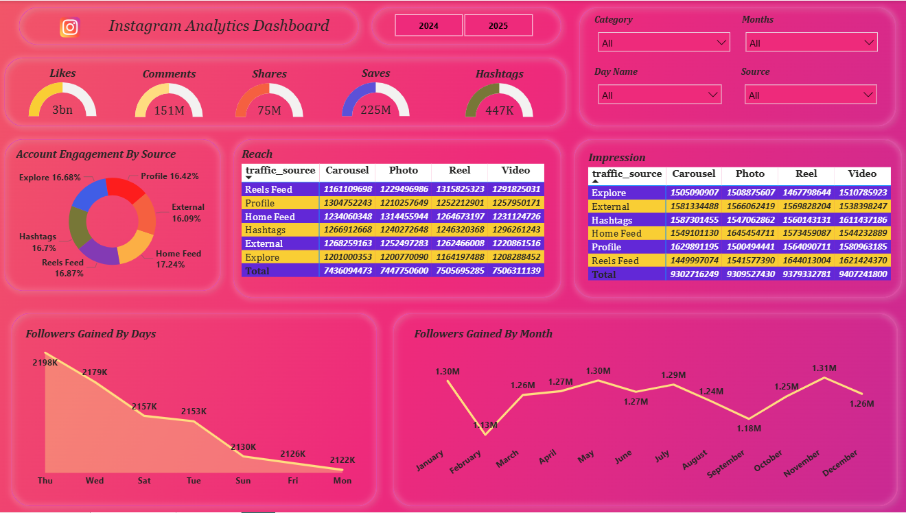

# 📊 Instagram Analytics (SQL + Power BI)

A complete Instagram analytics project using **SQL** for data analysis and **Power BI** for visualization.  
This project identifies engagement trends, traffic source performance, follower growth patterns, and content effectiveness.

---

## 📝 Problem Statement
Analyze Instagram content performance to identify:

- Total engagement across likes, comments, shares, and saves  
- Which traffic sources (Home, Explore, Reels Feed, Hashtags) drive maximum engagement  
- Follower growth patterns by day and month  
- Which media types (Reel, Photo, Carousel, Video) perform best in reach & impressions  
- Overall performance trends using a dashboard for decision-making  

---

## 📁 Project Structure

| File/Folder | Description |
|-------------|-------------|
| **Instagram Business Problem.pdf** | Business problem / objective of analysis |
| **Instagram_Dashboard.pbix** | Power BI dashboard file |
| **Instagram_Dashboard.png** | Dashboard preview image |
| **Sinstagram_queries.sql** | All SQL queries used in analysis |
| **Instagram_Analytics.csv** | Csv File |
---

## 🧰 Tools Used

| Tool | Purpose |
|------|---------|
| **MySQL** | Data analysis & KPI calculations |
| **Power BI** | Dashboard creation & visualization |
| **CSV/Excel** | Data formatting |

---

## 📜 SQL Queries Included
The SQL script covers:

- Total Likes, Comments, Shares, Saves  
- Total Hashtags  
- Engagement by Traffic Source  
- Followers gained by Day & Month  
- Reach & Impressions (Source × Media Type)  
- Views created for BI use  

All queries are available in:

📄 `SQL/instagram_queries.sql`

---

## 📊 Power BI Dashboard

### 🔹 Dashboard Preview

### 🔹 Dashboard File
📄 **Instagram_Dashboard.pbix** (Included in repository)

---

## 👤 Author  
**Ravi Kumar Gupta**  

---

## ⭐ Support  
If you like this project, please ⭐ the repository!

